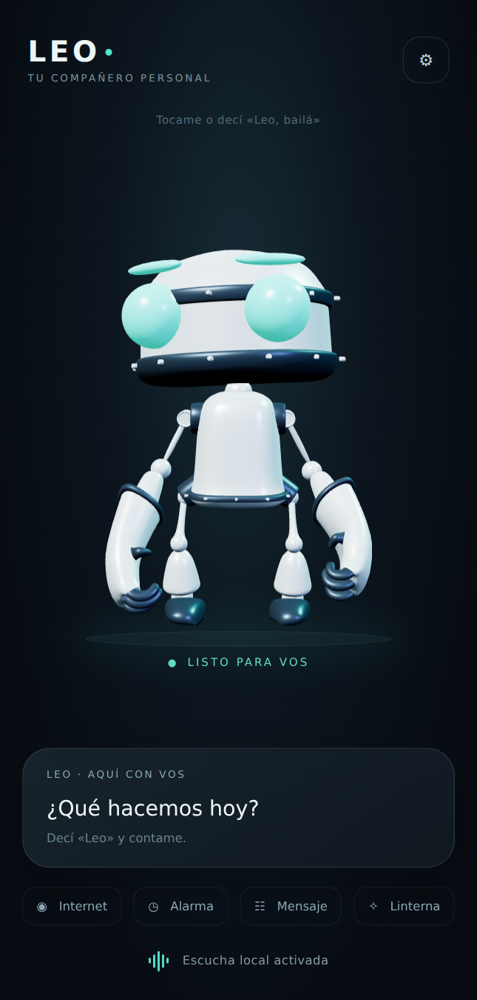

# LEO 0.11 · Robot 3D

LEO sustituye la N de la pantalla principal por un personaje articulado con superficies redondeadas, acabado perla, juntas de grafito y ojos turquesa. El modelo GLB y todos los movimientos están incluidos en la app: no requieren conexión ni descarga inicial.



[Ver los movimientos del robot](leo-robot-preview.mp4).

Esta imagen es una revisión del mismo GLB con Three.js; la interfaz de Android se implementa en Compose y su renderizador es Filament. La captura no procede de un teléfono.

## Interacción

| Situación | Comportamiento |
| --- | --- |
| Disponible | Respiración y postura relajada |
| Escuchando | Inclina la cabeza y presta atención |
| Pensando / buscando | Gesto de concentración |
| Hablando | Cabeza, expresiones y brazos animados durante la voz |
| «Leo, bailá» | Baile completo |
| «Leo, saltá» / «brincá» | Salto con aterrizaje |
| «Leo, girá» | Vuelta completa |
| «Leo, mové los brazos» / «saludame» | Saludo articulado |
| Toque sobre el robot | Alterna saludo, salto, baile y giro |
| «Leo, para» / desactivación | Cancela también el gesto |

Los comandos visuales se reconocen como frases completas. No capturan textos de mensajes ni búsquedas que contengan esas palabras. Las expresiones de habla siguen el estado de la voz; no son sincronización fonética de labios.

## Integración

- SceneView **2.3.3** sobre Google Filament **1.68.2**, compatible con el proyecto Kotlin/Java 17 actual. Sin AR, WebView ni permisos nuevos.
- Una animación activa y transición de 280 ms. Cada clip restablece los canales del anterior para evitar brazos bloqueados o giros acumulados.
- 30 fps en acciones/voz, 15 fps en reposo, 5 fps con movimiento reducido o pausa; el ciclo de vida detiene el renderizado al salir de la pantalla y libera sus recursos al destruirla.
- Respeta la desactivación de animaciones de Android. Conserva un retrato del mismo robot si falla la carga gráfica; la escucha y las acciones siguen independientes.
- El icono y la burbuja usan un retrato estático para evitar un renderizador permanente en segundo plano.

## Procedencia y reproducción

Modelo base **RobotExpressive**, creado por **Tomás Laulhé / Quaternius**. Conversión y expresiones por **Don McCurdy**. Distribuido bajo [CC0 1.0](https://creativecommons.org/publicdomain/zero/1.0/), según el [README del modelo en Three.js](https://github.com/mrdoob/three.js/blob/dev/examples/models/gltf/RobotExpressive/README.md).

[Fuente del GLB](https://raw.githubusercontent.com/mrdoob/three.js/dev/examples/models/gltf/RobotExpressive/RobotExpressive.glb). SHA-256 de origen: `047f5e5fb3bb6d378bd1df16ca6137f2a596c99b3a1b5690b4020c05aaf6f319`.

Cambios LEO: paleta, dos pasadas de subdivisión Loop para suavizar superficies, normales reconstruidas, pesos de dedos y morph targets interpolados con el mismo stencil, cuatro clips añadidos (Listen, Talk, Think, Spin) y canales de reposo completos. Se conserva la autoría del personaje original.

```sh
python scripts/prepare_leo_robot.py /ruta/RobotExpressive.glb
```

El script usa exclusivamente la biblioteca estándar de Python y rechaza una fuente distinta a la versión revisada. El motor [SceneView](https://github.com/sceneview/sceneview/tree/v2.3.3) usa licencia Apache-2.0; [Filament](https://github.com/google/filament) también usa Apache-2.0. Three.js se usa para revisión visual, no se distribuye dentro de Android.

## Validación

GLB validado con Khronos glTF Validator 2.0.0-dev.3.10: cero errores y cuatro avisos heredados de la jerarquía de las manos del rig original (nodos 72/73); sin avisos nuevos. La comprobación completa, sin truncar el informe, forma parte de CI. Revisadas las poses de reposo, escucha, habla, baile, giro, salto y saludo. Pruebas de comandos, transición, interrupción, repetición y movimiento reducido incluidas en `RobotMotionTest`.

Pendiente de prueba física: encuadre definitivo de Filament, consumo y fluidez en el teléfono del usuario. La revisión de escritorio no mide rendimiento Android.
